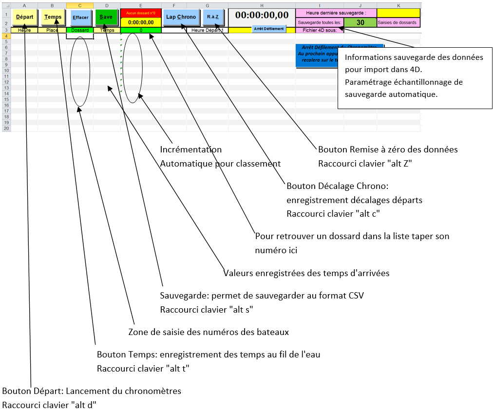

# Utiliser ChronoPC pour le chronométrage

## Présentation de l'interface

## Opération de chronométrage

1. Délencher un départ : bouton `Départ`
2. Capturer une arrivée : bouton `Temps`
3. Enregistrer un lap : bouton `Lap Chrono`
4. Saisi des dossards : à la volée, après des captures de temps

## Sauvegarde du fichier

Les données seront sauvegardées automatiquement suivant la valeur d'échantillonnage que vous aurez choisie, cela correspond au nombre de dossards saisis ou par la commande <kbd>alt</kbd> + <kbd>S</kbd> qui permet de sauvegarder à tout moment.

L’adresse du fichier 4D est inscrite dans le bandeau supérieur. Le nom du fichier pour 4D sera `Chronopc`, il sera sauvegarder dans le répertoire du fichier Excel.

Sur demande de remise à zéro :
- Tous les temps et numéros de dossards seront sauvegardés dans un fichier qui aura pour nom `ChronoPC + la date et l’heure de sauvegarde`, ce qui permet de conserver une trace des temps.
- Les LAPS seront sauvegardés dans un fichier Excel qui aura pour nom `Laps_départ_de_ + l’heure du premier départ de la vague`.

## Quelques conseils

- Afin d'éviter les blocages liés à la touche <kbd>alt</kbd>, il est recommandé de passer en mode affichage plein écran dans Excel (depuis le menu Affichage).
- L'utilisation de la combinaison de touche  <kbd>alt</kbd> + <kbd>T</kbd> est plus rapide pour la saisie des arrivées que l'appui avec la sourie sur le bouton "Temps" avec la sourie.
- Les commandes répondent plus rapidement si le logiciel est installé sur le disque dur au lieu de travailler sur une clé USB.
- Le chrono défilant n'est là que pour donner une indication du temps en cours.
- Après la capture d’un temps ou une sauvegarde par la commande  <kbd>alt</kbd> + <kbd>S</kbd>, le curseur viendra se positionner sur le prochain numéro de dossard à saisir.
- Il est possible de saisir des numéros de bateaux avant la capture du temps.

## Sécurités mises en place

- Impossible d'effectuer une sauvegarde si le fichier sauvegarde est en cours d'utilisation.
- Bouton départ verrouillé si départ donné.
- Demande de confirmation pour faire une remise à zéro des données.
- Double entrée d'un numéro de dossard, envoi d'un message (numéro dossard déjà saisi).
